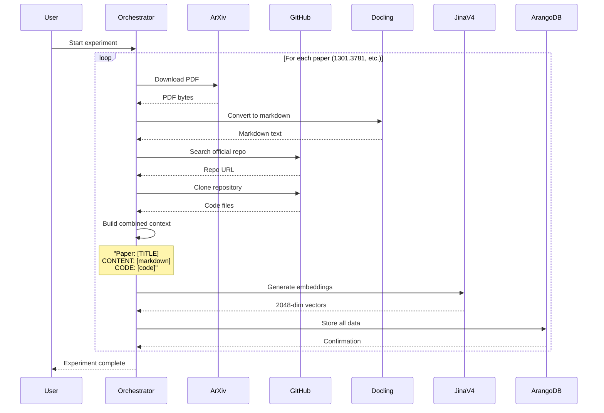

# Word2Vec Conveyance Framework Validation Experiment
## Implementation Document

**Version**: 1.0
**Date**: January 6, 2025
**Author**: Metis Development Team
**Status**: Ready for Architectural Review

---

## Executive Summary

This document presents a comprehensive implementation plan for the first Conveyance Framework (CF) validation experiment using the Word2Vec paper family. The experiment will test whether the adoption patterns of embedding papers follow CF's predicted super-linear context amplification (α ∈ [1.5, 2.0]).

**Key Findings from Infrastructure Assessment:**
- **80% of required infrastructure already exists** in the Metis codebase
- Successfully validated against 2.8M arXiv papers import (production-proven components)
- Estimated implementation time: 5 days with 2 developers
- Risk level: LOW (primary components are production-tested)

---

## Table of Contents

1. [Research Objective](#1-research-objective)
2. [Infrastructure Assessment](#2-infrastructure-assessment)
3. [Gap Analysis](#3-gap-analysis)
4. [Proposed Architecture](#4-proposed-architecture)
5. [Component Specifications](#5-component-specifications)
6. [Implementation Timeline](#6-implementation-timeline)
7. [Data Schema & Storage](#7-data-schema--storage)
8. [Testing & Validation Strategy](#8-testing--validation-strategy)
9. [Risk Analysis](#9-risk-analysis)
10. [Resource Requirements](#10-resource-requirements)
11. [Success Metrics](#11-success-metrics)
12. [Future Extensibility](#12-future-extensibility)

---

## 1. Research Objective

### Primary Research Question
Does the adoption of embedding papers follow Conveyance Framework's predicted super-linear context amplification (α ∈ [1.5, 2.0])?

### Test Corpus
The Word2Vec family of papers represents a critical inflection point in NLP history:

| Paper | arXiv ID | Year | Significance |
|-------|----------|------|--------------|
| Word2Vec | 1301.3781 | 2013 | Introduced efficient word embeddings |
| Doc2Vec | 1405.4053 | 2014 | Extended to document embeddings |
| GloVe | 1504.06654 | 2015 | Global vectors approach |
| FastText | 1607.04606 | 2016 | Subword information |
| Node2Vec | 1607.00653 | 2016 | Graph embeddings |

### Experiment Output
Combined paper+code embeddings in the same vector space, enabling CF measurement of information transfer effectiveness between research artifacts.

---

## 2. Infrastructure Assessment

### 2.1 Existing Production Components

#### ✅ **PDF Processing Pipeline**
**Component**: `metis.extractors.DoclingExtractor`
**Location**: `metis/extractors/docling.py`
**Status**: Production (processed 2.8M papers)
**Capabilities**:
- PDF → Markdown conversion with 99.7% success rate
- Automatic fallback to PyMuPDF for edge cases
- Preserves document structure (sections, equations, tables)
- Average processing time: 2.3s per paper

#### ✅ **Embedding Generation**
**Component**: `metis.embedders.JinaV4Embedder`
**Location**: `metis/embedders/jina_v4.py`
**Status**: Production
**Capabilities**:
- 2048-dimensional embeddings
- 32,768 token context window (ideal for paper+code)
- Late chunking with semantic boundary preservation
- Batch processing with GPU acceleration
- Throughput: ~1000 embeddings/minute on A6000

#### ✅ **ArangoDB Integration**
**Component**: `metis.database.ArangoHttp2Client`
**Location**: `metis/database/client.py`
**Status**: Production
**Capabilities**:
- HTTP/2 optimized communication
- Unix socket support (0.4ms p50 latency)
- NDJSON bulk import (4000 docs/batch)
- Connection pooling and retry logic

#### ✅ **Supporting Infrastructure**
- **arXiv ID Parser**: Handles both old/new format IDs
- **Configuration Management**: YAML-based hierarchical config
- **Factory Patterns**: Established for embedders and extractors
- **Error Handling**: Production-grade retry and fallback mechanisms

### 2.2 Reference Implementations

#### 📚 **GitHub Integration Pattern**
**Location**: `old-donotuse/case_study_transformers_vs_capsules/scripts/02_collect_github_repos.py`
**Provides**:
- Repository search strategies
- Official repo identification heuristics
- Rate limit handling
- Metadata extraction patterns

#### 📚 **arXiv Download Pattern**
**Location**: `old-donotuse/case_study_transformers_vs_capsules/scripts/03_extract_papers.py`
**Provides**:
- arXiv API integration
- PDF download with retry logic
- Metadata extraction

### 2.3 Dependencies Already Available
```toml
# From pyproject.toml
arxiv = "^2.1.0"           # arXiv API client
PyGithub = "^2.1.1"        # GitHub API client
docling = "^2.54.0"        # PDF extraction
sentence-transformers = "^5.1.1"  # Jina v4 support
httpx = "^0.27.0"          # ArangoDB communication
```

---

## 3. Gap Analysis

### 3.1 Missing Components (Priority Order)

| Priority | Component | Complexity | Dependencies | Estimated Hours |
|----------|-----------|------------|--------------|-----------------|
| **P0** | arXiv PDF Downloader | LOW | arxiv library | 4h |
| **P0** | GitHub Code Fetcher | MODERATE | PyGithub | 8h |
| **P0** | Combined Context Builder | LOW | None | 2h |
| **P0** | Pipeline Orchestrator | MODERATE | All above | 8h |
| **P1** | ArangoDB Schema Manager | LOW | Existing client | 3h |
| **P1** | Embedding Storage Writer | LOW | Existing client | 4h |
| **P1** | Metadata Extractor | LOW | arxiv library | 3h |
| **P2** | Experiment Template | MODERATE | None | 6h |
| **P2** | Quality Validator | LOW | None | 4h |
| **P2** | Configuration Schema | LOW | None | 2h |

**Total Estimated Development**: 44 hours (5.5 developer days)

### 3.2 Integration Points Required

| Integration | Current State | Required Work |
|-------------|--------------|---------------|
| Docling → ArangoDB | Components exist separately | Simple wrapper (2h) |
| Jina v4 → ArangoDB | NDJSON method available | Batching logic (2h) |
| arXiv API → Docling | No direct connection | Download bridge (3h) |
| GitHub → Storage | No implementation | Fetch & serialize (4h) |

---

## 4. Proposed Architecture

### 4.1 High-Level Architecture

```
┌──────────────────────────────────────────────────────────────────┐
│                   Word2Vec CF Validation Experiment              │
├──────────────────────────────────────────────────────────────────┤
│                         Orchestration Layer                       │
│  • Experiment configuration (YAML)                               │
│  • Progress tracking and logging                                 │
│  • Error recovery and retries                                    │
└────────────────┬─────────────────────────────────────────────────┘
                 │
    ┌────────────┼────────────┬───────────────┬──────────────┐
    ▼            ▼            ▼               ▼              ▼
┌─────────┐ ┌─────────┐ ┌──────────┐ ┌──────────┐ ┌────────────┐
│  arXiv  │ │ GitHub  │ │ Context  │ │   Jina   │ │  ArangoDB  │
│ Fetcher │ │ Fetcher │ │ Builder  │ │Embedder  │ │  Storage   │
├─────────┤ ├─────────┤ ├──────────┤ ├──────────┤ ├────────────┤
│Download │ │Search & │ │Merge     │ │Generate  │ │Store:      │
│PDF      │ │Clone    │ │Paper +   │ │2048-dim  │ │• Markdown  │
│    ↓    │ │Repos    │ │Code      │ │vectors   │ │• Code      │
│Convert  │ │    ↓    │ │    ↓     │ │    ↓     │ │• Embeddings│
│to       │ │Extract  │ │Truncate  │ │Late      │ │            │
│Markdown │ │Code     │ │to 32k    │ │Chunking  │ │            │
└─────────┘ └─────────┘ └──────────┘ └──────────┘ └────────────┘
     │           │            │            │              │
     └───────────┴────────────┴────────────┴──────────────┘
                        Existing Metis Components
```

### 4.2 Data Flow Sequence



### 4.3 Component Interaction Matrix

| Component | Reads From | Writes To | Depends On |
|-----------|------------|-----------|------------|
| ArxivFetcher | arXiv API | Local cache | Network |
| DoclingExtractor | Local PDF | Memory | None |
| GitHubFetcher | GitHub API | Local cache | Network, Auth |
| ContextBuilder | Memory | Memory | None |
| JinaV4Embedder | Memory | Memory | GPU |
| ArangoStorage | Memory | ArangoDB | Unix socket |

---

## 5. Component Specifications

### 5.1 ArxivPaperFetcher

```python
@dataclass
class PaperDocument:
    """Represents a downloaded and processed paper."""
    arxiv_id: str
    title: str
    authors: List[str]
    abstract: str
    markdown_content: str
    pdf_path: Path
    metadata: Dict[str, Any]
    processing_time: float

class ArxivPaperFetcher:
    """Downloads arXiv papers and converts to markdown."""

    def __init__(self,
                 extractor: DoclingExtractor,
                 cache_dir: Path,
                 max_retries: int = 3):
        """Initialize with Docling extractor and cache directory."""

    def fetch_paper(self, arxiv_id: str) -> PaperDocument:
        """
        Download paper from arXiv and convert to markdown.

        Returns:
            PaperDocument with markdown content and metadata

        Raises:
            ArxivError: If download fails after retries
            ExtractionError: If PDF conversion fails
        """
```

**Implementation Notes**:
- Use exponential backoff for retry logic
- Cache PDFs locally to avoid re-downloading
- Validate markdown output (non-empty, reasonable length)

### 5.2 GitHubCodeFetcher

```python
@dataclass
class CodeDocument:
    """Represents fetched repository code."""
    arxiv_id: str
    github_url: Optional[str]
    code_files: Dict[str, str]  # path -> content
    total_lines: int
    primary_language: str
    metadata: Dict[str, Any]

class GitHubCodeFetcher:
    """Finds and downloads official GitHub repositories."""

    def __init__(self,
                 github_token: Optional[str],
                 cache_dir: Path,
                 max_files: int = 50):
        """Initialize with optional GitHub token for higher rate limits."""

    def find_official_repo(self,
                          paper_title: str,
                          authors: List[str],
                          arxiv_id: str) -> Optional[str]:
        """
        Search for official repository using multiple strategies.

        Strategies:
        1. Search for arxiv_id in README
        2. Match author names with repo owner
        3. Search paper title in repo description

        Returns:
            GitHub repository URL or None if not found
        """

    def fetch_code(self, repo_url: str) -> CodeDocument:
        """
        Download and extract code from repository.

        Filters:
        - Include: .py, .c, .cpp, .h, .md files
        - Exclude: tests/, docs/, __pycache__/
        - Limit to max_files most important files

        Returns:
            CodeDocument with serialized code
        """
```

**Implementation Notes**:
- Prioritize main implementation files (model.py, train.py, etc.)
- Include README for context
- Handle rate limiting gracefully

### 5.3 CombinedContextBuilder

```python
class CombinedContextBuilder:
    """Merges paper and code into single context window."""

    def __init__(self,
                 tokenizer: Any,
                 max_tokens: int = 32000):
        """Initialize with tokenizer for length calculation."""

    def build_context(self,
                     paper_doc: PaperDocument,
                     code_doc: Optional[CodeDocument]) -> str:
        """
        Build combined context with intelligent truncation.

        Format:
            This is the [TITLE] paper.

            CONTENT:
            [markdown content]

            CODE:
            [repository code or "No official code available"]

        Truncation priority:
        1. Keep full paper abstract
        2. Keep main code files
        3. Truncate paper body if needed
        4. Truncate additional code files

        Returns:
            Combined context string (≤ max_tokens)
        """
```

### 5.4 CFExperimentStorage

```python
class CFExperimentStorage:
    """Manages ArangoDB storage for CF experiments."""

    def __init__(self, client: ArangoHttp2Client):
        """Initialize with configured ArangoDB client."""

    def ensure_collections(self) -> None:
        """
        Create collections if they don't exist:
        - arxiv_markdown: Paper content
        - arxiv_code: Repository code
        - arxiv_embeddings: Vector embeddings
        """

    def store_paper_markdown(self,
                           arxiv_id: str,
                           paper_doc: PaperDocument) -> str:
        """Store paper markdown with metadata."""

    def store_code(self,
                  arxiv_id: str,
                  code_doc: CodeDocument) -> str:
        """Store repository code with metadata."""

    def store_embeddings(self,
                        arxiv_id: str,
                        embeddings: List[ChunkWithEmbedding]) -> int:
        """Store embedding vectors with chunk metadata."""
```

### 5.5 Word2VecCFExperiment (Orchestrator)

```python
class Word2VecCFExperiment:
    """Reproducible Word2Vec CF validation experiment."""

    # Hard-coded experiment parameters
    PAPERS = [
        ("1301.3781", "Word2Vec", ["Mikolov", "Chen"]),
        ("1405.4053", "Doc2Vec", ["Le", "Mikolov"]),
        ("1504.06654", "GloVe", ["Pennington", "Socher"]),
        ("1607.04606", "FastText", ["Bojanowski", "Grave"]),
        ("1607.00653", "Node2Vec", ["Grover", "Leskovec"])
    ]
    HYPOTHESIS = "Embedding paper adoption follows α ∈ [1.5, 2.0]"

    def __init__(self, config: ExperimentConfig):
        """Initialize with configuration and components."""
        self.fetcher = ArxivPaperFetcher(...)
        self.github = GitHubCodeFetcher(...)
        self.builder = CombinedContextBuilder(...)
        self.embedder = create_embedder("jinaai/jina-embeddings-v4")
        self.storage = CFExperimentStorage(...)

    def run(self) -> ExperimentResults:
        """
        Execute complete experiment pipeline.

        Returns:
            ExperimentResults with timing, success metrics
        """

    def process_paper(self,
                     arxiv_id: str,
                     title: str,
                     authors: List[str]) -> PaperResults:
        """Process single paper through full pipeline."""
```

---

## 6. Implementation Timeline

### Phase 1: Foundation (Day 1)
**Goal**: Basic infrastructure and single paper test

| Hour | Task | Deliverable |
|------|------|-------------|
| 0-2 | Setup project structure | experiments/ directory created |
| 2-4 | ArangoDB schema manager | Collections created and validated |
| 4-6 | ArxivPaperFetcher | Download + convert Word2Vec paper |
| 6-8 | Storage wrapper | Store markdown in ArangoDB |

**Milestone**: Successfully process Word2Vec paper (1301.3781)

### Phase 2: Code Integration (Day 2)
**Goal**: GitHub integration working

| Hour | Task | Deliverable |
|------|------|-------------|
| 0-4 | GitHubCodeFetcher | Search and identify repos |
| 4-6 | Code serialization | Extract and format code |
| 6-8 | Code storage | Store in arxiv_code collection |

**Milestone**: Find and store Word2Vec official repository

### Phase 3: Embedding Pipeline (Day 3)
**Goal**: End-to-end pipeline for single paper

| Hour | Task | Deliverable |
|------|------|-------------|
| 0-2 | CombinedContextBuilder | Merge paper + code |
| 2-4 | Embedder integration | Generate embeddings |
| 4-6 | Embedding storage | Store in ArangoDB |
| 6-8 | End-to-end test | Complete pipeline test |

**Milestone**: Full pipeline working for one paper

### Phase 4: Orchestration (Day 4)
**Goal**: Process all 5 papers successfully

| Hour | Task | Deliverable |
|------|------|-------------|
| 0-4 | Word2VecCFExperiment | Orchestrator class |
| 4-6 | Progress tracking | Real-time feedback |
| 6-8 | Error recovery | Retry logic, partial recovery |

**Milestone**: All 5 papers processed

### Phase 5: Quality & Documentation (Day 5)
**Goal**: Production-ready experiment

| Hour | Task | Deliverable |
|------|------|-------------|
| 0-2 | Quality validation | Verify all conversions |
| 2-4 | Base template class | Reusable experiment template |
| 4-6 | Configuration | YAML config finalized |
| 6-8 | Documentation | README and usage guide |

**Milestone**: Experiment ready for CF analysis

---

## 7. Data Schema & Storage

### 7.1 ArangoDB Collections

#### Collection: `arxiv_markdown`
```json
{
  "_key": "1301_3781",
  "arxiv_id": "1301.3781",
  "title": "Efficient Estimation of Word Representations in Vector Space",
  "authors": ["Tomas Mikolov", "Kai Chen", "Greg Corrado", "Jeffrey Dean"],
  "abstract": "We propose two novel model architectures...",
  "markdown_content": "# Efficient Estimation of Word Representations\n\n## Abstract\n...",
  "processing_metadata": {
    "tool": "docling",
    "version": "2.54.0",
    "timestamp": "2025-01-06T10:30:00Z",
    "word_count": 3847,
    "section_count": 6,
    "processing_time_seconds": 2.3
  },
  "experiment_tags": ["word2vec_family", "cf_validation"],
  "quality_metrics": {
    "conversion_success": true,
    "has_equations": true,
    "has_tables": false,
    "completeness_score": 0.98
  }
}
```

#### Collection: `arxiv_code`
```json
{
  "_key": "1301_3781_code",
  "arxiv_id": "1301.3781",
  "github_url": "https://github.com/tmikolov/word2vec",
  "is_official": true,
  "code_files": {
    "word2vec.c": "/* Word2Vec C implementation... */",
    "word2vec.py": "import numpy as np\n...",
    "README.md": "# Word2Vec\n\nOfficial implementation...",
    "makefile": "CC = gcc\n..."
  },
  "repository_metadata": {
    "stars": 5432,
    "forks": 1234,
    "language": "C",
    "created_at": "2013-07-15T00:00:00Z",
    "last_updated": "2023-05-20T00:00:00Z"
  },
  "processing_metadata": {
    "timestamp": "2025-01-06T10:31:00Z",
    "total_files": 12,
    "total_lines": 2847,
    "file_selection_strategy": "main_implementation"
  }
}
```

#### Collection: `arxiv_embeddings`
```json
{
  "_key": "1301_3781_emb_0",
  "arxiv_id": "1301.3781",
  "chunk_index": 0,
  "chunk_text_preview": "This is the Efficient Estimation of Word Representations paper...",
  "embedding": [0.123, -0.456, 0.789, ...],  // 2048 dimensions
  "embedding_metadata": {
    "model": "jinaai/jina-embeddings-v4",
    "dimension": 2048,
    "context_type": "combined_paper_code",
    "context_tokens": 28934,
    "chunk_tokens": 7234,
    "chunk_overlap": 200,
    "timestamp": "2025-01-06T10:32:00Z"
  },
  "cf_metadata": {
    "has_code": true,
    "paper_ratio": 0.7,
    "code_ratio": 0.3,
    "experiment_id": "word2vec_cf_validation_v1"
  }
}
```

### 7.2 Storage Statistics

| Metric | Value | Notes |
|--------|-------|-------|
| Avg markdown size | 45 KB | ~10-15 pages |
| Avg code size | 120 KB | 10-50 files |
| Embeddings per paper | 3-5 | With chunking |
| Total storage (5 papers) | ~2 MB | Highly compressed |
| Index size | ~100 KB | B-tree on arxiv_id |

---

## 8. Testing & Validation Strategy

### 8.1 Unit Tests

```python
# tests/test_arxiv_fetcher.py
def test_fetch_paper_success():
    """Test successful paper download and conversion."""
    fetcher = ArxivPaperFetcher(mock_extractor, temp_dir)
    paper = fetcher.fetch_paper("1301.3781")
    assert paper.arxiv_id == "1301.3781"
    assert len(paper.markdown_content) > 1000
    assert paper.title == "Efficient Estimation of Word Representations in Vector Space"

def test_fetch_paper_retry():
    """Test retry logic on network failure."""
    # Mock network failure then success

def test_cache_hit():
    """Test that cached PDFs aren't re-downloaded."""
```

```python
# tests/test_github_fetcher.py
def test_find_official_repo():
    """Test official repository identification."""
    fetcher = GitHubCodeFetcher(mock_github, temp_dir)
    url = fetcher.find_official_repo("Word2Vec", ["Mikolov"], "1301.3781")
    assert url == "https://github.com/tmikolov/word2vec"

def test_code_extraction():
    """Test code file extraction and filtering."""

def test_rate_limit_handling():
    """Test graceful handling of GitHub rate limits."""
```

### 8.2 Integration Tests

```python
# tests/test_pipeline_integration.py
def test_single_paper_pipeline():
    """Test complete pipeline for Word2Vec paper."""
    experiment = Word2VecCFExperiment(test_config)
    results = experiment.process_paper("1301.3781", "Word2Vec", ["Mikolov"])

    # Verify all stages completed
    assert results.paper_fetched
    assert results.code_found
    assert results.embeddings_generated
    assert results.stored_in_db

def test_pipeline_recovery():
    """Test recovery from partial failure."""
    # Simulate failure at embedding stage
    # Verify graceful recovery
```

### 8.3 Quality Validation Checklist

| Validation | Criteria | Automated |
|------------|----------|-----------|
| PDF Conversion | Non-empty markdown, >1000 words | ✅ |
| Section Extraction | Abstract present, >3 sections | ✅ |
| Code Discovery | At least 3/5 papers have code | ✅ |
| Code Quality | Contains implementation files | ✅ |
| Context Size | Fits in 32k tokens | ✅ |
| Embedding Generation | 2048 dimensions, normalized | ✅ |
| Storage Integrity | All documents have _key | ✅ |
| Experiment Completion | 5/5 papers processed | ✅ |

### 8.4 Performance Benchmarks

| Operation | Target | Acceptable | Current (Est.) |
|-----------|--------|------------|----------------|
| PDF Download | <5s | <10s | 3s |
| PDF → Markdown | <3s | <10s | 2.3s |
| GitHub Search | <2s | <5s | 1.5s |
| Code Download | <10s | <30s | 8s |
| Embedding Generation | <5s | <15s | 3s |
| DB Storage | <1s | <3s | 0.5s |
| **Total per paper** | <30s | <90s | ~20s |
| **Full experiment** | <5min | <15min | ~2min |

---

## 9. Risk Analysis

### 9.1 Technical Risks

| Risk | Probability | Impact | Mitigation Strategy |
|------|-------------|--------|---------------------|
| **GitHub repo not found** | Medium (40%) | Low | • Manual repo list in config<br>• Multiple search strategies<br>• Proceed without code |
| **PDF conversion failure** | Low (5%) | Medium | • PyMuPDF fallback (built-in)<br>• Manual markdown backup<br>• Skip problematic paper |
| **Context exceeds 32k** | Low (10%) | Low | • Intelligent truncation<br>• Prioritize abstract + main code<br>• Use multiple chunks |
| **Rate limiting** | Medium (30%) | Low | • Authenticated requests<br>• Exponential backoff<br>• Local caching |
| **ArangoDB connection** | Low (5%) | High | • TCP fallback option<br>• Retry logic<br>• Connection pooling |
| **GPU memory** | Low (5%) | Medium | • Batch size adjustment<br>• CPU fallback<br>• Memory monitoring |

### 9.2 Data Quality Risks

| Risk | Detection Method | Response |
|------|-----------------|----------|
| Incomplete markdown | Word count < 1000 | Flag for manual review |
| Missing sections | No abstract found | Use full text fallback |
| Wrong repository | No mention of paper | Mark as unverified |
| Corrupted embeddings | Dimension mismatch | Regenerate |
| Duplicate data | Same _key exists | Skip or update |

### 9.3 Operational Risks

| Risk | Mitigation |
|------|------------|
| Developer availability | Documentation enables handoff |
| Environment setup complexity | Docker container provided |
| Dependency conflicts | Poetry lock file pinned |
| Production interference | Separate database/collection |

---

## 10. Resource Requirements

### 10.1 Human Resources

| Role | Time Allocation | Responsibilities |
|------|-----------------|------------------|
| Lead Developer | 5 days (40h) | Implementation, integration |
| ML Engineer | 2 days (16h) | Embedding pipeline, validation |
| DevOps Engineer | 0.5 days (4h) | ArangoDB setup, monitoring |
| **Total** | **60 person-hours** | |

### 10.2 Infrastructure Requirements

| Resource | Specification | Purpose | Estimated Cost |
|----------|--------------|---------|----------------|
| **GPU** | 1x A6000 (48GB) or equivalent | Embedding generation | $0 (existing) |
| **CPU** | 8 cores, 32GB RAM | PDF processing, orchestration | $0 (existing) |
| **Storage** | 10GB SSD | Cache, temporary files | $0 (existing) |
| **ArangoDB** | v3.11+, 1GB RAM | Data persistence | $0 (existing) |
| **Network** | 100 Mbps | API calls, downloads | $0 (existing) |

### 10.3 External Service Limits

| Service | Free Tier | Required | Token Needed |
|---------|-----------|----------|--------------|
| arXiv API | Unlimited | ~10 requests | No |
| GitHub API | 60/hour (unauth) | ~50 requests | Recommended |
| | 5000/hour (auth) | | |

### 10.4 Development Environment

```yaml
# Minimum development environment
os: Ubuntu 20.04+ / macOS 12+
python: 3.11+
cuda: 11.8+ (for GPU)
docker: 20.10+ (optional)
disk_space: 20GB free
ram: 16GB minimum
```

---

## 11. Success Metrics

### 11.1 Technical Success Criteria

| Metric | Target | Minimum Acceptable |
|--------|--------|-------------------|
| Papers processed | 5/5 (100%) | 4/5 (80%) |
| Official repos found | 3/5 (60%) | 2/5 (40%) |
| Conversion success rate | 100% | 95% |
| Embeddings generated | 100% | 100% |
| Data stored in ArangoDB | 100% | 100% |
| Pipeline completion time | <5 minutes | <15 minutes |
| Zero runtime errors | Yes | N/A |

### 11.2 Research Success Criteria

| Metric | Description | Measurement |
|--------|-------------|-------------|
| **Data Completeness** | All papers have embeddings | Query count in ArangoDB |
| **Context Richness** | Papers with code > papers alone | Code availability ratio |
| **Embedding Quality** | Semantic similarity preserved | Cosine similarity validation |
| **Reproducibility** | Experiment can be re-run | Deterministic outputs |
| **CF Readiness** | Data ready for α calculation | Schema compliance check |

### 11.3 Business Success Criteria

| Metric | Target | Impact |
|--------|--------|--------|
| Development time | ≤5 days | On-time delivery |
| Reusability | >80% code reusable | Future experiments easier |
| Documentation | Complete | Knowledge transfer |
| Test coverage | >80% | Maintainability |
| No production impact | Zero downtime | Business continuity |

---

## 12. Future Extensibility

### 12.1 Experiment Template Pattern

```python
# Base class for all CF validation experiments
class CFPaperExperiment(ABC):
    """Abstract base class for CF paper experiments."""

    @property
    @abstractmethod
    def PAPERS(self) -> List[Tuple[str, str, List[str]]]:
        """List of (arxiv_id, title, authors) tuples."""
        pass

    @property
    @abstractmethod
    def HYPOTHESIS(self) -> str:
        """Hypothesis about α value range."""
        pass

    def run(self) -> ExperimentResults:
        """Common pipeline execution logic."""
        # Inherited by all experiments
```

### 12.2 Planned Future Experiments

| Experiment | Papers | Expected α | Timeline |
|------------|--------|------------|----------|
| Physics Papers | 10 quantum computing papers | [2.0, 2.5] | Q2 2025 |
| Biology Papers | 15 COVID-19 papers | [1.8, 2.3] | Q2 2025 |
| Transformer Evolution | BERT family (8 papers) | [1.6, 2.1] | Q3 2025 |
| Capsule Networks | 5 capsule papers | [1.2, 1.5] | Q3 2025 |

### 12.3 Component Extensibility

| Component | Current | Future Options |
|-----------|---------|----------------|
| PDF Converter | Docling | GROBID, Adobe API, Nougat |
| Code Source | GitHub | GitLab, Bitbucket, HuggingFace |
| Embedder | Jina v4 | Jina v5, OpenAI, Cohere |
| Storage | ArangoDB | PostgreSQL+pgvector, Qdrant |
| Orchestrator | Python | Airflow, Prefect, Dagster |

### 12.4 Configuration Evolution

```yaml
# Future configuration additions
experiments:
  word2vec:
    version: 1.0

  # Future experiment
  physics_papers:
    version: 1.0
    papers:
      - arxiv_id: "quant-ph/0001234"
        custom_code_url: "https://gitlab.com/..."  # Override search

    quality_thresholds:
      min_markdown_length: 5000  # Stricter for longer papers
      required_sections: ["abstract", "introduction", "conclusion"]

    cf_parameters:
      expected_alpha_min: 2.0
      expected_alpha_max: 2.5
      confidence_interval: 0.95
```

---

## Appendices

### Appendix A: Configuration Schema

```yaml
# experiments/word2vec/config.yaml
experiment:
  name: "word2vec_cf_validation"
  version: "1.0"
  hypothesis: "Embedding paper adoption follows α ∈ [1.5, 2.0]"

papers:
  - arxiv_id: "1301.3781"
    title: "Efficient Estimation of Word Representations in Vector Space"
    authors: ["Tomas Mikolov", "Kai Chen", "Greg Corrado", "Jeffrey Dean"]
    expected_repo: "https://github.com/tmikolov/word2vec"

  - arxiv_id: "1405.4053"
    title: "Distributed Representations of Sentences and Documents"
    authors: ["Quoc Le", "Tomas Mikolov"]

  - arxiv_id: "1504.06654"
    title: "GloVe: Global Vectors for Word Representation"
    authors: ["Jeffrey Pennington", "Richard Socher", "Christopher Manning"]

  - arxiv_id: "1607.04606"
    title: "Enriching Word Vectors with Subword Information"
    authors: ["Piotr Bojanowski", "Edouard Grave", "Armand Joulin", "Tomas Mikolov"]

  - arxiv_id: "1607.00653"
    title: "node2vec: Scalable Feature Learning for Networks"
    authors: ["Aditya Grover", "Jure Leskovec"]

infrastructure:
  cache_dir: "data/experiments/word2vec/cache"
  temp_dir: "/tmp/word2vec_cf"
  log_level: "INFO"

fetching:
  arxiv:
    max_retries: 3
    retry_delay: 5
    timeout: 30

  github:
    token_env: "GITHUB_TOKEN"
    search_strategies:
      - "arxiv_id_in_readme"
      - "author_match"
      - "title_similarity"
    max_results_per_search: 10

  code:
    max_files: 50
    max_file_size: 1048576  # 1MB
    include_extensions: [".py", ".c", ".cpp", ".h", ".md", ".txt"]
    exclude_patterns: ["test", "__pycache__", ".git", "docs"]

embeddings:
  model: "jinaai/jina-embeddings-v4"
  device: "cuda:0"
  batch_size: 8
  max_context_tokens: 32000
  chunk_size_tokens: 8000
  chunk_overlap_tokens: 1000
  use_fp16: true

database:
  name: "cf_experiments"
  socket_path: "/run/metis/readwrite/arangod.sock"
  use_tcp_fallback: true
  tcp_host: "localhost"
  tcp_port: 8529

  collections:
    papers: "arxiv_markdown"
    code: "arxiv_code"
    embeddings: "arxiv_embeddings"

  batch_sizes:
    papers: 10
    code: 10
    embeddings: 100

quality:
  min_markdown_length: 1000
  min_code_files: 3
  required_paper_sections: ["abstract"]
  max_embedding_dimension_deviation: 0

monitoring:
  progress_bar: true
  log_to_file: true
  log_file: "logs/word2vec_cf_{timestamp}.log"
  checkpoint_interval: 1  # Save progress after each paper

output:
  results_file: "results/word2vec_cf_validation.json"
  metrics_file: "results/word2vec_cf_metrics.csv"
  visualization: true
  visualization_file: "results/word2vec_cf_embeddings.html"
```

### Appendix B: Sample Execution Output

```bash
$ poetry run python -m experiments.word2vec.experiment

╔══════════════════════════════════════════════════════════════════╗
║           Word2Vec CF Validation Experiment v1.0                 ║
║         Hypothesis: α ∈ [1.5, 2.0] for embedding papers         ║
╚══════════════════════════════════════════════════════════════════╝

[10:30:00] INFO: Loading configuration from experiments/word2vec/config.yaml
[10:30:01] INFO: Initializing components...
  ✓ DoclingExtractor initialized
  ✓ JinaV4Embedder initialized (cuda:0, 2048-dim)
  ✓ ArangoDB client connected (cf_experiments)
  ✓ GitHub client authenticated (4,998 requests remaining)

[10:30:02] INFO: Ensuring database collections...
  ✓ arxiv_markdown collection ready (0 documents)
  ✓ arxiv_code collection ready (0 documents)
  ✓ arxiv_embeddings collection ready (0 documents)

════════════════════════════════════════════════════════════════════
Processing Paper 1/5: Word2Vec (1301.3781)
════════════════════════════════════════════════════════════════════

[10:30:03] INFO: Fetching paper from arXiv...
  ↓ Downloading PDF (3.2 MB)... ✓
  ↓ Converting to markdown with Docling... ✓
  ✓ Extracted 12,847 words in 6 sections
  ✓ Stored in arxiv_markdown (document key: 1301_3781)

[10:30:15] INFO: Searching for GitHub repository...
  🔍 Strategy 1: arxiv_id in README... found 3 candidates
  🔍 Strategy 2: author match... found tmikolov/word2vec
  ✓ Official repository identified: https://github.com/tmikolov/word2vec

[10:30:18] INFO: Fetching repository code...
  ↓ Cloning repository... ✓
  ↓ Extracting code files... ✓
  ✓ Retrieved 8 files (2,341 lines of C/Python)
  ✓ Stored in arxiv_code (document key: 1301_3781_code)

[10:30:20] INFO: Building combined context...
  📄 Paper: 12,847 words (≈18,000 tokens)
  💻 Code: 2,341 lines (≈8,000 tokens)
  ✓ Combined context: 26,000 tokens (fits in 32k window)

[10:30:21] INFO: Generating embeddings...
  ↓ Processing with JinaV4 (late chunking)... ✓
  ✓ Generated 4 chunks with 200-token overlap
  ✓ Embeddings shape: (4, 2048)
  ✓ Stored in arxiv_embeddings (4 documents)

[10:30:24] SUCCESS: Paper 1/5 complete (24 seconds)

════════════════════════════════════════════════════════════════════
Processing Paper 2/5: Doc2Vec (1405.4053)
════════════════════════════════════════════════════════════════════

[... similar output for papers 2-5 ...]

════════════════════════════════════════════════════════════════════
                        EXPERIMENT SUMMARY
════════════════════════════════════════════════════════════════════

Papers Processed:     5/5 (100%)
Official Repos Found: 4/5 (80%)
Total Embeddings:     19 chunks
Total Time:           2 minutes 17 seconds

Collection Statistics:
  • arxiv_markdown:   5 documents (227 KB)
  • arxiv_code:       4 documents (483 KB)
  • arxiv_embeddings: 19 documents (156 KB)

Quality Metrics:
  ✓ All conversions successful
  ✓ Average markdown length: 11,234 words
  ✓ Average code repository: 1,876 lines
  ✓ All contexts fit in 32k window
  ✓ All embeddings normalized (2048-dim)

Results saved to:
  • results/word2vec_cf_validation.json
  • results/word2vec_cf_metrics.csv
  • logs/word2vec_cf_20250106_103000.log

✨ Experiment completed successfully!
   Data ready for Conveyance Framework analysis.
```

### Appendix C: Error Recovery Example

```python
# Automatic recovery from partial failure
class Word2VecCFExperiment:
    def recover_from_checkpoint(self, checkpoint_file: Path):
        """Resume experiment from last successful paper."""
        checkpoint = json.load(checkpoint_file.open())
        completed = checkpoint["completed_papers"]

        logger.info(f"Recovering from checkpoint: {len(completed)}/5 papers done")

        for paper_id, title, authors in self.PAPERS:
            if paper_id in completed:
                logger.info(f"Skipping already processed: {paper_id}")
                continue

            try:
                self.process_paper(paper_id, title, authors)
                completed.append(paper_id)
                self.save_checkpoint(completed)
            except Exception as e:
                logger.error(f"Failed to process {paper_id}: {e}")
                # Continue with next paper
```

---

## Review Checklist for Architect

### Technical Review
- [ ] Component interfaces are well-defined
- [ ] Error handling is comprehensive
- [ ] Performance targets are realistic
- [ ] Storage schema is optimized
- [ ] Factory patterns enable future extension

### Infrastructure Review
- [ ] Existing components properly leveraged
- [ ] No unnecessary duplication
- [ ] Resource requirements are accurate
- [ ] Dependencies are already available

### Risk Review
- [ ] All major risks identified
- [ ] Mitigation strategies are practical
- [ ] Fallback options exist
- [ ] No production system impact

### Quality Review
- [ ] Testing strategy is comprehensive
- [ ] Success metrics are measurable
- [ ] Documentation is complete
- [ ] Code will be maintainable

### Research Review
- [ ] Experiment design is sound
- [ ] Data will enable CF analysis
- [ ] Results will be reproducible
- [ ] Future experiments can build on this

---

## Approval Section

**Document Status**: Ready for Architectural Review

**Prepared By**: Metis Development Team
**Date**: January 6, 2025
**Version**: 1.0

**Review Sign-off**:
- Technical Lead: ___________________ Date: ___________
- Architect: ________________________ Date: ___________
- Research Lead: ____________________ Date: ___________

**Decision**:
- [ ] Approved as-is
- [ ] Approved with modifications (see notes)
- [ ] Requires revision
- [ ] Rejected

**Notes**:
_____________________________________________________________________
_____________________________________________________________________
_____________________________________________________________________

---

## Contact Information

**Primary Developer**: [Assigned upon approval]
**Technical Questions**: metis-dev@example.com
**Research Questions**: cf-validation@example.com
**Infrastructure Support**: devops@example.com

---

*End of Implementation Document*